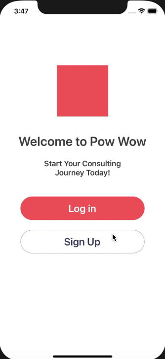
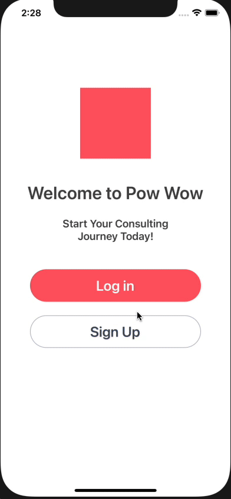

# Pow-Wow
Consulting On Demand for iOS

## Sprint 4

## Table of Contents
1. [Overview](#Overview)
1. [Product Spec](#Product-Spec)
1. [Wireframes](#Wireframes)
2. [Schema](#Schema)

## Overview
### Description
A platform that provides a wide range of on-demand consulting services. Users can either hire consultants or create and showcase their consultant profile. Consultants can optimize their profile to showcase their services and work in-app with clients. Users can search for consultants based off need and hire consultants in-app, on-demand.

### App Evaluation
- **Category:** Business
- **Mobile:** iOS Application
- **Story:** A better solution to connecting businesses and consultants.
- **Market:** Users can either be consultants or businesses.
- **Habit:** Business will search for professionals. Consultants will respond and work with businesses after inquiry.
- **Scope:** On Demand, Consulting Platform

## Product Spec

### 1. User Stories (Required and Optional)

**Required Must-have Stories**

* **User can open the app**
* - [x] User can see a *app icon*
* - [x] User can see a *launch screen with app icon*
* - [x] User can see an *initial page*
* - [x] User can see a *login button* (on the initial page)
* - [x] User can see a *register button* (on the initial page)
* **User can navigate to the login page by clicking the login button (on the initial page)**
* ** User can navigate to the register page by clicking the register button (on the initial page)**
* - [x] User can see a *login page*
* - [x] ** User can login to their account on the login page**
* - [x] User can see a *"enter username" section* (on the login page)
* - [x] User can see a *"enter password" section* (on the login page)
* - [x] User can see a *"login" button* (on the login page)
* - [x] ** User can enter their username in the "enter username" section (on the login page)**
* - [x] ** User can enter their password in the "enter password" section (on the login page)**
* - [x] ** User can click the "login" button (on the login page) to navigate to the feed**
* - [x] User can see a error message *"Username or password incorrect. Please try again."*, if login credentials are incorrect.
* - [x] ** User can see a register page**
* - [x] User can see a *"enter first name" section* (on the register page)
* - [x] User can see a *"enter last name" section* (on the register page)
* - [x] User can see a *"enter email" section* (on the register page)
* - [x] User can see a *"create username" section* (on the register page)
* - [x] User can see a *"create password" section* (on the register page)
* - [x] User can see a *"confirm password" section* (on the register page)
* - [x] User can see a *"sign up"** button* (on the register page)
* **User can enter their first name in the "enter first name" section (on the register page)**
* **User can enter their last name in the "enter last name" section (on the register page)**
* **User can enter their email in the "enter email" section (on the register page)**
* - [x] User can see an error message *"This email is taken or not valid."* if the email is already associated with an account or in the wrong format
* ** User can enter a username in the "create username" section (on the register page)**
* - [x] User can see an error message *"This username is taken or not valid."* if the username is already associated with an account or in the wrong format
* **User can enter a password in the "enter password" section (on the register page)**
* - [x] User can see an error message *"This password is invalid"* if the password in the wrong format
* **User can enter a password in the "confirm password" section (on the register page)**
* - [x] User can see an error message *"Passwords do not match"* if the passwords in both sections do not match
* **User can click the "sign up" button* (on the register page) to navigate to the login page**
* - [x] User can see a error message *"One or more fields are incomplete. Please try again."*, if registration credentials are incomplete
* - [x] User can see a *feed page*
* - [x] User can see a *vertical feed of consultant or business profiles* (on the feed page)
* **User can vertically scroll through the feed page**
* - [x] User can see a *"profile" button* (on the feed page)
* **User can click the "profile" button to navigate to the "profile" page**
* - [x] User can see a *"search/filter" button* (on the feed page)
* **User can click the "search" button to navigate to the "search/filter" page**
* - [x] User can see a *"settings" button* (on the feed page)
* **User can click the "settings" button to navigate to the "settings" page**
* - [x] User can see a *"logout" button* (on the feed page)
* **User can click the "logout" button to logout**
* - [x] User can see a *profile page*
* **User can update their profile information**
* - [x] User can see a *"profile" section* (on the profile page)
* **User can select a "business or consultant" option (in the business section) (on the profile page)**
* - [x] User can see an *"edit name" section* (in the business section) (on the profile page)
* **User can enter their business name in the "edit name" section (in the business section) (on the profile page)**
* - [x] User can see an *"edit profile picture" section* (in the business section) (on the profile page)
* **User can upload their profile picture in the "edit profile picture" section (in the business section) (on the profile page)**
* - [x] User can see an *"edit banner picture" section* (in the business section) (on the profile page)
* **User can upload their banner picture in the "edit banner picture" section (in the business section) (on the profile page)**
* - [x] User can see an *"edit industry" section* (in the business section) (on the profile page)
* **User can select their business industry out of the options in the "industry" section (in the business section) (on the profile page)**
* - [x] User can see an *"edit keywords" section* (in the business section) (on the profile page)
* **User can enter their business keywords in the "edit keywords" section (in the business section) (on the profile page)**
* - [x] User can see an *"edit bio" section* (in the business section) (on the profile page)
* **User can enter their business biography in the "edit bio" section (in the business section) (on the profile page)**
* - [x] User can see a *"save and publish" button* (in the business section) (on the profile page)
* **User can click the "save and publish" button (in the business section) (on the profile page)**
* - [x] User can see a *search/filter page*
* **User can edit preferences (on the search/filter page)**
* - [ ] User can see a *list of options* to filter the search on the feed (on the search/filter page)
* **User can select businesses or consultants (with a checkbox) (on the search/filter page)**
* **User can select different industries (with a checkbox) (on the search/filter page)**
* - [x] User can see a *"save" button* (on the search/filter page)
* **User can search keywords in a search bar (typing text) (on the search/filter page)**
* - [x] User can see a *"search" button* (on the search/filter page)
* **User can click the "search" button (on the search/filter page) to query the search based off their edited preferences**
* - [x] User can see a *settings page*
* - [x] User can see an *"account" section* (on the settings page)
* **User can edit their account information (on the settings page)**
* - [x] User can see an *"edit first name" section* (in the account section)
* **User can enter a new first name in the "edit first name" section (in the account section)**
* - [x] User can see an *"edit last name" section* (in the account section)
* **User can enter a new last name in the "edit last name" section (in the account section)**
* - [x] User can see an *"edit email" section* (in the account section)
* **User can enter a new email in the "edit email" section (in the account section)**
* - [x] User can see an *"edit phone" section* (in the account section)
* **User can enter a new phone number in the "edit phone" section (in the account section)**
* - [x] User can see an *"edit username" section* (in the account section)
* **User can enter a new username in the "edit username" section (in the account section)**
* - [x] User can see an *"security" section* (on the settings page)
* - [x] User can see a *"change password" section* (in the security section section)
* **User can change their password in the "change password" section (in the security section)**
* - [x] User can see an *"enter new password" section* (in the security section)
* **User can enter their new password in the "enter new password" section (in the security section)**
* - [x] User can see a *"confirm new password" section* (in the security section)
* **User can enter their confirmed password in the "confirm new password" section (in the security section)**
* - [x] User can see an *"about" section* (on the settings page)
* - [x] User can see an *"help" section* (on the settings page)
* - [x] User can see an *"contact us" section* (on the settings page)

**Optional Nice-to-have Stories**
* User can click to expand each consultant profile
* User can message a consultant, in-app
* User can hire a consultant, in-app
* User can pay a consultant, in-app
* User can schedule a meeting with a consultant, in-app
* User can meet with a consultant with zoom, in-app integration

### 2. Screen Archetypes

* **Launch Screen**
   * - [x] User can see a launch screen with app icon
* **Initial Page**
   * - [x] User can see a *login button* (on the initial page)
   * - [x] User can see a *register button* (on the initial page)
* **Login Page**
   * - [x] User can see a *"enter username" section* (on the login page)
   * - [x] User can see a *"enter password" section* (on the login page)
   * - [x] User can see a *"login" button* (on the login page)
   * - [x] User can see a error message *"Username or password incorrect. Please try again."*, if login credentials are incorrect.
* **Register Page**
   * - [x] User can see a *"enter first name" section* (on the register page)
   * - [x] User can see a *"enter last name" section* (on the register page)
   * - [x] User can see a *"enter email" section* (on the register page)
   * - [x] User can see a *"create username" section* (on the register page)
   * - [x] User can see a *"create password" section* (on the register page)
   * - [x] User can see a *"confirm password" section* (on the register page)
   * - [x] User can see a *"sign up"** button* (on the register page)
   * - [x] User can see an error message *"This email is taken or not valid."* if the email is already associated with an account or in the wrong format
   * - [x] User can see an error message *"This username is taken or not valid."* if the username is already associated with an account or in the wrong format
   * - [x] User can see an error message *"This password is invalid"* if the password in the wrong format
   * - [x] User can see an error message *"Passwords do not match"* if the passwords in both sections do not match
   * - [x] User can see a error message *"One or more fields are incomplete. Please try again."*, if registration credentials are incomplete
* **Feed Page**
   * - [x] User can see a *vertical feed of consultant or business profiles* (on the feed page)
   * - [x] User can see a *"profile" button* (on the feed page)
   * - [x] User can see a *"search/filter" button* (on the feed page)
   * - [x] User can see a *"settings" button* (on the feed page)
   * - [x] User can see a *"logout" button* (on the feed page)
* **Profile Page**
   * - [x] User can see a *"business and consultant" section* (on the profile page)
   * - [x] User can see a *"business or consultant" option* (in the business section) (on the profile page)
   * - [x] User can see an *"edit name" section* (in the business section) (on the profile page)
   * - [x] User can see an *"edit profile picture" section* (in the business section) (on the profile page)
   * - [x] User can see an *"edit banner picture" section* (in the business section) (on the profile page)
   * - [x] User can see an *"edit industry" section* (in the business section) (on the profile page)
   * - [x] User can see an *"edit keywords" section* (in the business section) (on the profile page)
   * - [x] User can see an *"edit bio" section* (in the business section) (on the profile page)
   * - [x] User can see a *"save and publish" button* (in the business section) (on the profile page)
* **Search Page**
   * - [x] User can see a *list of options* to filter the search on the feed (on the search/filter page)
   * - [x] User can see an option for *businesses or consultants* (with a checkbox) (on the search/filter page)
   * - [x] User can see an option for different industries (with a checkbox) (on the search/filter page)
   * - [x] User can see a *"save" button* (on the search/filter page)
   * - [x] User can see a section to search keywords in a search bar (typing text) (on the search/filter page)
   * - [x] User can see a *"search" button* (on the search/filter page)
* **Settings Page**
   * - [x] User can see an "account" section (on the settings page)
   * - [x] User can see an "edit first name" section (in the account section)
   * - [x] User can see an "edit last name" section (in the account section)
   * - [x] User can see an "edit email" section (in the account section)
   * - [x] User can see an "edit username" section (in the account section)
   * - [x] User can see a "save" button (in the account section)
   * - [x] User can see a "change password" section (in the security section)
   * - [x] User can see an "enter new password" section (in the security section)
   * - [x] User can see a "confirm new password" section (in the security section)
   * - [x] User can see a "save" button (in the security section)
   * - [x] User can see an "about" section (on the settings page)
   * - [x] User can see an "help" section (on the settings page)
   * - [x] User can see an "contact us" section (on the settings page)
* **View Other User Profile** *(Nice-To-Have) !!!*
* **Message Other User** *(Nice-To-Have) !!!*
* **Pay Other User** *(Nice-To-Have) !!!*
* **Schedule Meeting With Other User** *(Nice-To-Have) !!!*
* **Meeting With Other User (Zoom)** *(Nice-To-Have) !!!*

### 3. Navigation

**Flow Navigation** (Screen to Screen)

* (1) **Launch Screen**
* (2) **Initial Page**
   * (3a) Login Page, or
   * (3b) Register Page
* (3a) **Login Page**
   * (4) Feed Page
* (3b) **Register Page**
   * (3a) Login Page
* (4) **Feed Page** (Home Page)
   * (2) Initial Page (Logout)
   * (5a) Profile Page, or
   * (5b) Search Page, or
   * (5c) Settings Page
   * *(6) View Other User Profile Page (Nice-To-Have)*
* (5a) **Profile Page**
   * (4) Feed Page
* (5b) **Search Page**
   * (4) Feed Page
* (5c) **Settings Page**
   * (4) Feed Page
* (6) *View Other User Profile Page (Nice-To-Have)*
   * (7) Message Other User Page
   * (8) Pay Other User Page
   * (9) Schedule Meeting With Other User Page
   * (10) Meeting With Other User (Zoom) Page
* (7) *Message Other User Page (Nice-To-Have)*
* (8) *Pay Other User Page (Nice-To-Have)*
* (9) *Schedule Meeting With Other User Page (Nice-To-Have)*
* (10) *Meeting With Other User (Zoom) Page (Nice-To-Have)*

## Wireframes

### [BONUS] Digital Wireframes & Mockups

### [BONUS] Interactive Prototype

## Schema 
### Models
#### User Account

   | Property      | Type     | Description  |
   | ------------- | -------- | ------------ |
   | objectID      | String   | unique id for the user account (default field) |
   | userAccount   | Pointer  | pointer to the user account |
   | firstName     | String   | first name of user |
   | lastName      | String   | last name of user |
   | email         | String   | email of user |
   | username      | String   | unique username for user login |
   | password      | String   | secure password for user login |
   
#### Professional Profile

   | Property      | Type     | Description  |
   | ------------- | -------- | ------------ |
   | objectID      | String   | unique id for the user profile (equal to user objectID) |
   | proProfile    | Pointer  | pointer to the professional profile |
   | proType       | String   | type of professional profile (only "business" or "consultant") |
   | proName       | String   | name of business or consultant |
   | proPicture    | File     | profile picture for business or consultant |
   | banPicture    | File     | banner picture for business or consultant |
   | proIndustry   | String   | industry of business or consultant |
   | proKeywords   | String Array | array of keywords that best describe professional profile |
   | proBio        | String   | biography for professional profile |
   
#### Search Preferences

   | Property      | Type     | Description  |
   | ------------- | -------- | ------------ |
   | objectID      | String   | unique id for the user account (equal to user objectID) |
   | industries    | String Array | array of industries of professional profiles to query |
   | keywords      | String Array   | array of keywords for professional profiles to query |
   
### Networking
List of network requests by page
* Feed Page
   * (Read/GET) Query professional profiles
* Search Page 
   * (Update/PUT) Update search preferences for the feed page
* Profile Page
   * (Create/POST) Create a new professional profile
   * (Update/PUT) Update professional profile
   * (Delete) Delete professional profile
* Register Page
   * (Create/POST) Create a new user account
* Settings Page
   * (Update/PUT) Update user account information
   * (Delete) Delete user account
