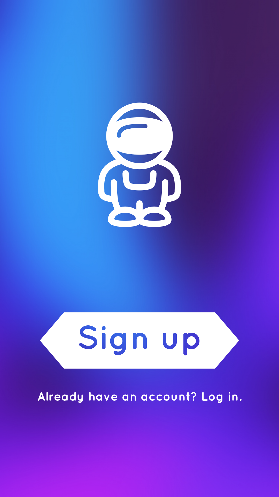

# Pow-Wow
Consulting On Demand for iOS

## Table of Contents
1. [Overview](#Overview)
1. [Product Spec](#Product-Spec)
1. [Wireframes](#Wireframes)
2. [Schema](#Schema)

## Overview
### Description
A platform that provides a wide range of on-demand consulting services. Users can either hire consultants or create and showcase their consultant profile. Consultants can optimize their profile to showcase their services and work in-app with clients. Users can search for consultants based off need and hire consultants in-app, on-demand.

### App Evaluation
- **Category:** Business
- **Mobile:** iOS Application
- **Story:** A better solution to connecting businesses and consultants.
- **Market:** Users can either be consultants or businesses.
- **Habit:** Business will search for professionals. Consultants will respond and work with businesses after inquiry.
- **Scope:** On Demand, Consulting Platform

## Product Spec

### 1. User Stories (Required and Optional)

**Required Must-have Stories**

* **User can see a app icon**
* **User can see a launch screen with app icon**
* **User can see an initial page**
* User can see a **login button** (on the initial page)
* User can see a **register button** (on the initial page)
* User can *navigate to the login page* by clicking the login button (on the initial page)
* User can *navigate to the register page* by clicking the register button (on the initial page)
* **User can see a login page**
* User can see a **"enter username"** section (on the login page)
* User can see a **"enter password"** section (on the login page)
* User can see a **"login"** button (on the login page)
* User can *enter their username* in the "enter username" section (on the login page)
* User can *enter their password* in the "enter password" section (on the login page)
* User can *click the "login" button* (on the login page) to navigate to the feed
* User can see a error message *"Username or password incorrect. Please try again."*, if login credentials are incorrect.
* **User can see a register page**
* User can see a **"enter first name"** section (on the register page)
* User can see a **"enter last name"** section (on the register page)
* User can see a **"enter email"** section (on the register page)
* User can see a **"create username"** section (on the register page)
* User can see a **"create password"** section (on the register page)
* User can see a **"confirm password"** section (on the register page)
* User can see a **"sign up"** button (on the register page)
* User can *enter their first name* in the "enter first name" section (on the register page)
* User can *enter their last name* in the "enter last name" section (on the register page)
* User can *enter their email* in the "enter email" section (on the register page)
* User can see an error message *"This email is taken or not valid."* if the email is already associated with an account or in the wrong format
* User can *enter a username* in the "create username" section (on the register page)
* User can see an error message *"This username is taken or not valid."* if the username is already associated with an account or in the wrong format
* User can *enter a password* in the "enter password" section (on the register page)
* User can see an error message *"This password is invalid"* if the password in the wrong format
* User can *enter a password* in the "confirm password" section (on the register page)
* User can see an error message *"Passwords do not match"* if the passwords in both sections do not match
* User can *click the "sign up" button* (on the register page) to navigate to the login page
* User can see a error message *"One or more fields are incomplete. Please try again."*, if registration credentials are incomplete
* **User can see a feed page**
* User can see a vertical **feed of consultant and business profiles** on the feed page
* User can see a **"profile" button** (on the feed page)
* User can click the "profile" button to **navigate to the "profile"** page
* User can see a **"search/filter" button** (on the feed page)
* User can click the "search" button to **navigate to the "search/filter"** page
* User can see a **"settings" button** (on the feed page)
* User can click the "settings" button to **navigate to the "settings"** page
* **User can see a profile page**
* User can update their profile information
* User can see a **"business" section** (on the profile page)
* User can see a **"business or consultant"** option (in the business section) (on the profile page)
* User can see an **"edit name"** section (in the business section) (on the profile page)
* User can see an **"edit profile picture"** section (in the business section) (on the profile page)
* User can see an **"edit banner picture"** section (in the business section) (on the profile page)
* User can see an **"edit industry"** section (in the business section) (on the profile page)
* User can see an **"edit keywords"** sections (in the business section) (on the profile page)
* User can see an **"edit bio"** section (in the business section) (on the profile page)
* User can see a **"save and publish"** button (in the business section) (on the profile page)
* **User can see a search/filter page**
* **User can see a list of options to filter the search on the feed** (on the search/filter page)
* User have the option to **select different industries** (with a checkbox) (on the search/filter page)
* User can see a **"save" button* (on the search/filter page)
* User have the option to **search keywords in a search bar** (typing text) (on the search/filter page)
* User can see a **"search" button** (on the search/filter page)
* **User can see a settings page**
* User can see an **"account" section** (on the settings page)
* User can see an **"edit first name"** section (in the account section)
* User can see an **"edit last name"** section (in the account section)
* User can see an **"edit email"** section (in the account section)
* User can see an **"edit username"** section (in the account section)
* User can see a **"change password"** section (in the account section)
* User can see an **"enter new password"** section (in the account section)
* User can see a **"confirm new password"** section (in the account section)
* User can see a **"save"** button (in the account section)

**Optional Nice-to-have Stories**
* User can click to expand each consultant profile
* User can message a consultant, in-app
* User can hire a consultant, in-app
* User can pay a consultant, in-app
* User can schedule a meeting with a consultant, in-app
* User can meet with a consultant with zoom, in-app integration

### 2. Screen Archetypes

* **Launch Screen**
   * User can see a launch screen with app icon
* **Initial Page**
   * User can see a login button
   * User can see a register button
   * User can click login button to redirect to login page
   * User can click register button to redirect to register page
* **Login Page**
   * User can see a "enter username" section (on the login page)
   * User can see a "enter password" section (on the login page)
   * User can see a "login" button (on the login page)
   * User can *enter their username* in the "enter username" section (on the login page)
   * User can *enter their password* in the "enter password" section (on the login page)
   * User can *click the "login" button* (on the login page) to navigate to the feed
   * User can see a error message *"Username or password incorrect. Please try again."*, if login credentials are incorrect.
* **Register page**
   * User can see a "enter first name" section (on the register page)
   * User can see a "enter last name" section (on the register page)
   * User can see a "enter email" section (on the register page)
   * User can see a "create username" section (on the register page)
   * User can see a "create password" section (on the register page)
   * User can see a "confirm password" section (on the register page)
   * User can see a "sign up" button (on the register page)
   * User can *enter their first name* in the "enter first name" section (on the register page)
   * User can *enter their last name* in the "enter last name" section (on the register page)
   * User can *enter their email* in the "enter email" section (on the register page)
   * User can see an error message *"This email is taken or not valid."* if the email is already associated with an account or in the wrong format
   * User can *enter a username* in the "create username" section (on the register page)
   * User can see an error message *"This username is taken or not valid."* if the username is already associated with an account or in the wrong format
   * User can *enter a password* in the "enter password" section (on the register page)
   * User can see an error message *"This password is invalid"* if the password in the wrong format
   * User can *enter a password* in the "confirm password" section (on the register page)
   * User can see an error message *"Passwords do not match"* if the passwords in both sections do not match
   * User can *click the "sign up" button* (on the register page) to navigate to the login page
   * User can see a error message *"One or more fields are incomplete. Please try again."*, if registration credentials are incomplete
* **Feed**
   * User can see a vertical feed of consultant and business profiles on the feed page
   * User can see a "profile" button (on the feed page)
   * User can click the "profile" button to navigate to the "profile" page
   * User can see a "search/filter" button (on the feed page)
   * User can click the "search" button to navigate to the "search/filter" page
   * User can see a "settings" button (on the feed page)
   * User can click the "settings" button to navigate to the "settings" page
* **Profile**
   * User can update their profile information
   * User can see a "business" section (on the profile page)
   * User can see a "business or consultant" option (in the business section)
   * User can see an "edit name" section (in the business section)
   * User can see an "edit profile picture" section (in the business section)
   * User can see an "edit banner picture" section (in the business section)
   * User can see an "edit industry" section (in the business section)
   * User can see an "edit keywords" sections (in the business section)
   * User can see an "edit bio" section (in the business section)
   * User can see a "save and publish" button (in the business section)
* **Search**
   * User can see a list of options to filter the search on the feed
   * User have the option to select different industries (with a checkbox)
   * User can see a "save" button
   * User have the option to search keywords in a search bar** (typing text)
   * User can see a "search" button
* **Settings**
   * User can see an "account" section (on the settings page)
   * User can see an "edit first name" section (in the account section)
   * User can see an "edit last name" section (in the account section)
   * User can see an "edit email" section (in the account section)
   * User can see an "edit username" section (in the account section)
   * User can see a "change password" section (in the account section)
   * User can see an "enter new password" section (in the account section)
   * User can see a "confirm new password" section (in the account section)
   * User can see a "save" button (in the account section)
* **View Other User Profile** *(Nice-To-Have) !!!*
* **Message Other User** *(Nice-To-Have) !!!*
* **Pay Other User** *(Nice-To-Have) !!!*
* **Schedule Meeting With Other User** *(Nice-To-Have) !!!*
* **Meeting With Other User (Zoom)** *(Nice-To-Have) !!!*

### 3. Navigation

**Flow Navigation** (Screen to Screen)

(1) **Launch Screen**
(2) **Initial Page**
   * (3a) Login Page, or
   * (3b) Register Page
(3a) **Login Page**
   * (4) Feed Page
(3b) **Register Page**
   * (3a) Login Page
(4) **Feed Page** (Home Page)
   * (5a) Profile Page, or
   * (5b) Search Page, or
   * (5c) Settings Page
   * *(6) View Other User Profile Page (Nice-To-Have)*
(5a) **Profile Page**
   * (4) Feed Page
(5b) **Search Page**
   * (4) Feed Page
(5c) **Settings Page**
   * (4) Feed Page
(6) *View Other User Profile Page (Nice-To-Have)*
   * (7) Message Other User Page
   * (8) Pay Other User Page
   * (9) 
   * (10)
(7) *Message Other User Page (Nice-To-Have)*
(8) *Pay Other User Page (Nice-To-Have*

## Wireframes
[Add picture of your hand sketched wireframes in this section]

### [BONUS] Digital Wireframes & Mockups

### [BONUS] Interactive Prototype

## Schema 
[This section will be completed in Unit 9]
### Models
[Add table of models]
### Networking
- [Add list of network requests by screen ]
- [Create basic snippets for each Parse network request]
- [OPTIONAL: List endpoints if using existing API such as Yelp]
